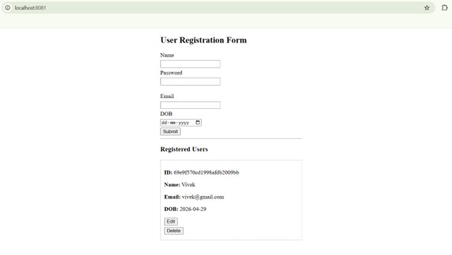

# 🚀 Web Tech ModelPrac CAT1


A full-stack User Management System demonstrating REST API operations (**GET, POST, PUT, DELETE**) using AngularJS, Node.js, Express, MongoDB, with Docker and Kubernetes deployment.

---

## 📌 Project Overview

This project simulates a complete user workflow system:

- User Registration  
- User Login  
- Update Profile  
- Delete User  
- View User Data  

---

## 🌟 Features

| Feature      | Method | Description              |
|--------------|--------|--------------------------|
| Add User     | POST   | Register new user        |
| Login        | POST   | Validate credentials     |
| Update User  | PUT    | Modify details           |
| Delete User  | DELETE | Remove user              |
| Get Users    | GET    | Fetch user data          |

---

## 🧰 Tech Stack

- Frontend: AngularJS  
- Backend: Node.js + Express  
- Database: MongoDB + Mongoose  
- DevOps: Docker, Kubernetes  
- UI: HTML, CSS  

---

## 📸 Screenshots

> Add screenshots inside a `/screenshots` folder

### Registration Page


### Login Page


### Dashboard


---

## 🐳 Docker Setup

### Build and Run

```bash
docker-compose up --build
```

After first build:

```bash
docker-compose up
```

### Stop Containers

```bash
CTRL + C
```

### Remove Containers

```bash
docker-compose down
```

### Access App

```
http://localhost:8080
```

---

## 🗄️ MongoDB Access (Docker)

```bash
docker ps
docker exec -it <container-name> mongosh
```

```js
use users
db.register.find().pretty()
```

---

## ☸️ Kubernetes Setup

### Step 1: Build Images

```bash
docker build -t myapp/backend:latest ./server
docker build -t myapp/frontend:latest ./client
```

---

### Step 2: Deploy

```bash
kubectl apply -f namespace.yaml

kubectl apply -f mongo-pvc.yaml
kubectl apply -f mongo-deployment.yaml
kubectl apply -f mongo-service.yaml

kubectl apply -f backend-deployment.yaml
kubectl apply -f backend-service.yaml

kubectl apply -f frontend-deployment.yaml
kubectl apply -f frontend-service.yaml
```

---

### Step 3: Verify

```bash
kubectl get all -n myapp
```

---

### Step 4: Access Frontend

```bash
kubectl port-forward svc/frontend 8081:80 -n myapp
```

Open:
```
http://localhost:8081
```

---

### Step 5: Access Backend

```bash
kubectl port-forward svc/backend 3001:3000 -n myapp
```

---

### Step 6: Check Logs

```bash
kubectl logs -n myapp deployment/backend
```

---

### Step 7: MongoDB (Kubernetes)

```bash
kubectl get pods -n myapp
kubectl exec -n myapp -it <mongo-pod-name> -- mongosh
```

---

## 🎯 Learning Outcomes

- REST API development using Express  
- AngularJS frontend integration  
- MongoDB CRUD operations  
- Docker containerization  
- Kubernetes deployment  

---

## 📁 Project Structure

```
.
├── client/        # AngularJS frontend
├── server/        # Node.js backend
├── docker-compose.yml
├── k8s/           # Kubernetes YAML files
└── screenshots/   # Images for README
```

---

## 📄 License

This project is licensed under the MIT License.